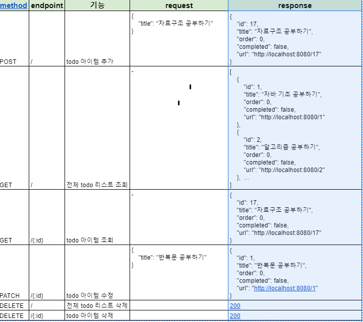

# 🎃Today I Learn
🔥10일차  
✅

# 인텔리제이
Todolist 만들기  
1. todo 리스트 목록에 아이템을 추가
2. todo 리스트 목록 중 특정 아이템을 조회
3. todo 리스트 전체 목록을 조회
4. todo 리스트 목록 중 특정 아이템을 수정
5. todo 리스트 목록 중 특정 아이템을 삭제
6. todo 리스트 전체 목록을 삭제

이런식으로 작업을 하는 습관이 좋음
   
인텔리제이 Java 프로젝트 만든 후 build.gradle 가서 dependency가 jupiter로 되어있는데  
이 부분을 없애줌
또한 plugin 부분에 springboot 플러그인을 추가해야함.
  
id 'org.springframework.boot' version '2.4.2'  
id 'io.spring.dependency-management' version '1.0.11.RELEASE'
  
또한 dependancy부분에 springboot 관련 의존성 추가  
implementation 'org.springframework.boot:spring-boot-starter-data-rest'  
implementation 'org.springframework.boot:spring-boot-starter-data-jpa'  
runtimeOnly 'com.h2database:h2'
annotationProcessor("org.projectlombok:lombok")  
compleOnly("org.projectlombok:lombok")
   

❗️❗️ :

⚠️

